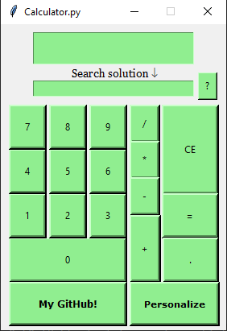

## Calculadora costumizável

### Descrição do Projeto
Calculadora em Python que realiza as operações básicas e tem foco em costumização.

### 📑 Funcionalidades

- [x] Cálculo com vírgula em todas as operações básicas.
- [x] Automação web por busca de solução para uma dúvida.
- [ ] Implementar menu de personalização.

### 📌 Pré-requisitos

Antes de começar, você vai precisar ter instalado em sua máquina as seguintes ferramentas: [Git](https://git-scm.com) e [Python](https://www.python.org/). Além disto é bom ter um editor para trabalhar com o código como [VSCode](https://code.visualstudio.com/) ou [PyCharm](https://www.jetbrains.com/pt-br/pycharm/download/).

#### Drivers para browsers:
[ChromeDriver](https://sites.google.com/a/chromium.org/chromedriver/downloads) no Google Chrome ou o [geckodriver](https://github.com/mozilla/geckodriver/releases) no Firefox. Após o download coloque o arquivo do driver na mesma pasta que está o executável python no seu computador. Para qualquer dúvida no processo recomendo esse [vídeo](https://www.youtube.com/watch?v=y7OhuSGBt8o).

####  Instalar a biblioteca Selenium:
```bash
$ pip install selenium
```

#### Clonando do repositório
```bash
git clone https://github.com/llucasrafaell/calculator-costomizable
cd calculator-costomizable
```
#### Executando
```bash
python Calculator.py
```

### Screenshots

#### Tela principal
<p align="center">
  
</p>
